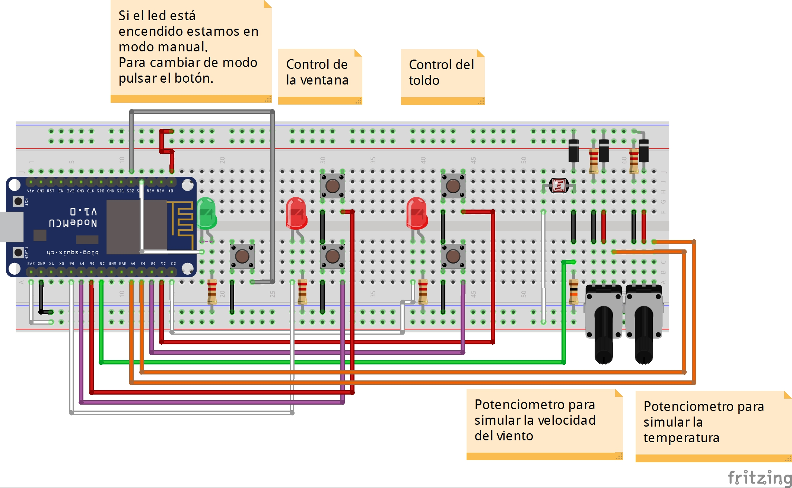
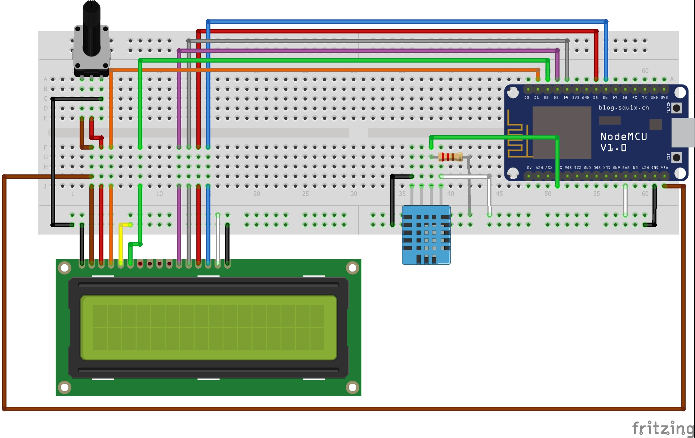

<h1>NodeMCU con Arduino</h1>
Para la realización de este proyecto, hemos utilizado dos NodeMCU.
Un primer NodeMcu que nombraremos "MCUEXT" el cual recogerá los datos climaticos:

 - Temperatura ambiente
 - Velocidad del viento
 - Iluminación

Además este dispositivo tendrá varios led para indicar cuando el toldo y la ventana se están moviendo. Para finalizar, el dispositivo cuenta con varios botones para interactuar con los motores del toldo y la ventana de forma manual.
Por otro lado tendremos un NodeMCU al que llamaremos "MCUINT" el cual tendrá un sensor DHT11 para medir la temperatura y la humedad, además de una pantalla LCD para mostrar la información de los distintos sensores.

<h2>Ensamblaje del MCUEXT</h2>
Para el ensamblaje de este dispositivo necesitamos los siguiente componentes:

 - 1 x NodeMCU
 - 2 x Led rojo
 - 1 x Led verde 
 - 5 x Pulsadores
 - 1 x Protoboard 63
 - 2 x Potenciometros de 50 KOhm
 - 1 x Fotoresistencia
 - 3 x Diodos Rectificadores (1N4007)
 - 5 x Resistencia 220 Ohm
 - 1 X Resistencia 10 KOhm

El esquema en Fritzing sería el siguiente:

<h2>Ensamblaje del MCUINT</h2>
Para el ensamblaje de este dispositivo necesitamos los siguiente componentes:

 - 1 x NodeMCU
 - 1 x DHT11
 - 1 x LCD Display 16*2
 - 1 x Potenciometro 50 KOhm
 - 1 x Protoboard 30
 - 5 x Resistencia 220 Ohm

El esquema en Fritzing sería el siguiente:
